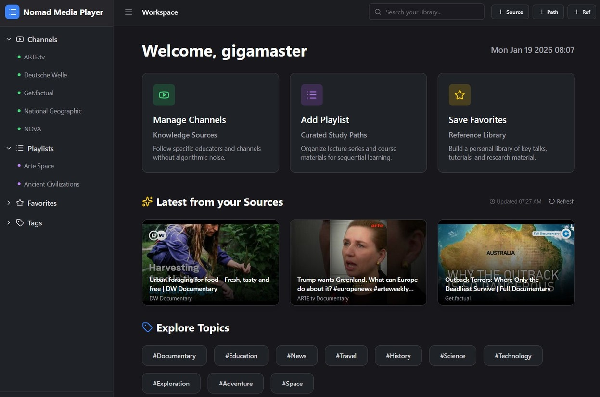

<div align="center">
  <a href="https://github.com/AI-Studio-Apps/vibe-code">
    
  </a>
  <a href="https://opensource.org/licenses/MIT">
    
  </a>
  <br/>
  <br/>
  <h1>🎥 Nomad Media Player</h1>
  <br/><a href="https://ai-studio-apps.github.io/nomad-media-player/" title="Open Nomad Media Player">
  
  </a>
  <br/>
  <br/>
</div>


Nomad Media Player is a self-hosted app that stores your favorite public video channels, playlists, and learning guides locally. Designed for digital nomads, it prioritizes local-first design and privacy.   

In an era of abundant information, Nomad Media Player is a purpose-built workspace for intentional viewing and research. It allows students and professionals to curate their own educational feeds, separating valuable learning resources from the algorithmic loops of entertainment platforms.

It fosters a proactive approach to media consumption, ensuring your time is spent on content you selected, not content suggested to you.


## Features 


| Feature                     | Description                                                                                                                                   |
| --------------------------- | --------------------------------------------------------------------------------------------------------------------------------------------- |
| Organize Your Content       | Easily manage your favorite video channels and create playlists. Save videos to your "Favorites" or "Watch Later" lists for convenient access. |
| AI-Powered Learning Guides  | Transform any video into a learning experience! Click the "brain" icon to generate a summary and engage in a chat to deepen your understanding of the content. |
| Seamless Platform Integration | Connect to popular video platforms using your API keys for a richer experience.                                                              |
| Custom & Free Proxy | Bypass restrictions with your own proxy server or automatically fallback to free proxies to overcome network restrictions and maintain privacy.                      |
| AI Gemini Integration       | Utilize your AI Gemini Free Tier API key to get learning guide with chat (Local LLM coming soon!).                                             |
| Backup Database | Securely export all your settings, channels, playlists, and favorites as a JSON file. Easily import this file to restore your data, ensuring you never lose your configurations. |


## Settings

### 🔑 API and RSS

Many video platforms have restricted or removed public RSS feeds to enforce tracking, control embedding, and monetize access. As a result, their content can no longer be fetched directly by browser-based apps due to CORS restrictions.

To preserve user privacy and enable client-side functionality, we use a lightweight, open proxy that:

- Only forwards requests to public content
- Adds the required CORS headers
- Runs without logging, tracking, or data retention

This ensures reliable access to public media while staying true to our local-first, privacy-respecting principles. However, public RSS feeds are increasingly unreliable or unavailable. Transitioning to official video platform APIs (like YouTube’s Data API) provides better stability, richer metadata, and access to more videos.

These APIs typically require a free developer account to generate an API key, but no payment or sensitive permissions are needed. Your key stays in your browser and encrypted by the app.


### 🎞 YouTube API key

To fetch your public YouTube videos or channel info, you’ll need a free **YouTube Data API key** from Google.

YouTube Data API v3 allows up to 50 items per request, full metadata, max-resolution thumbnails,   
and requires no "hacky" CORS proxies.

#### How to get it:  

1. Go to the [Google Cloud Console](https://console.cloud.google.com/)
2. Create a new project (or use an existing one)
3. Enable the **YouTube Data API v3**
4. Create an **API key** under "Credentials"
5. (Recommended) Restrict the key to your app’s domain and the YouTube API

#### Save it in the app:   

- Open the web app
- Go to **Settings → Integrations → YouTube**
- Paste your API key and click **Save**
- Your key is stored **only in your browser** (via IndexedDB).

> [!NOTE]
> This key only accesses **public data** (e.g., video titles, thumbnails). It cannot modify your channel or access private content.

## 🔐 Security

**Web Crypto API (window.crypto)** Modern browsers have built-in JavaScript APIs that allow web developers to perform cryptographic operations (encryption, decryption, signing) directly in the browser, enabling client-side encryption.

Since the data is stored in IndexedDB, it is sandboxed to your specific domain (origin).   
Other websites cannot access it.

Using the Web Crypto API (window.crypto) ensures that sensitive data (like the API Key) is encrypted before it is saved to IndexedDB.

1. Zero-Knowledge Architecture: The database will only store a Salt and a Verifier for the user. It will never store the password.
2. Session Key: When the user logs in, it derives a CryptoKey from the password + the stored salt. This key exists only in memory (RAM) while the page is open.
3. Encrypted API Key: The YouTube API Key is encrypted with this Session Key before being stored. Even if someone steals the database file, they cannot use the API Key without the user's password.

> [!CAUTION]
> Client-Side Encryption Enabled: Your password and API keys are encrypted in your browser using AES-GCM and PBKDF2. We cannot recover your password if you lose it.


## 🛠 Development

### Run Locally

**Prerequisites:**  Node.js

1. Install dependencies:
   `npm install`
2. Run the app:
   `npm run dev`
3. Create an account
4. Set the YouTube `API_KEY` in **Settings**


### 🌍 Video platforms

Nomad Media Player design to support multiple video platforms beyond YouTube.   
The following review outlines current and planned integrations—focusing on services that offer public, client-side–friendly APIs for fetching playlist and video metadata.

All integrations should be implemented **without backend dependencies**, using only browser-based requests to official public APIs.

Most major video platforms offer public REST APIs, but access, cost, and ease of use vary significantly. Below is a clear, practical comparison focused on free-tier availability, authentication needs, and suitability for a client-side app like nomad-media-player (hosted on GitHub Pages).

### ✅ Quick Summary Table

| Platform     | Free Public API? | Auth Required? | Client-Side Friendly? | Notes |
|--------------|------------------|----------------|------------------------|-------|
| **YouTube**  | ✅ Yes (API key) | ❌ No (for public data) | ✅ Yes | Best for your use case |
| **Vimeo**    | ✅ Yes (basic)   | ❌ No (public videos) | ✅ Yes | Simple, clean REST API |
| **Dailymotion** | ✅ Yes        | ❌ No (public content) | ✅ Yes | Underrated, easy to use |
| **Twitch**   | ✅ Yes           | ✅ Yes (OAuth/client ID) | ⚠️ Limited | Only **public stream/channel info**; no VODs without auth |
| **TikTok**   | ❌ **No public API** | — | ❌ No | No official way to fetch user videos by URL |


### 🔍 Detailed Breakdown

#### 1. **YouTube**  
- **API**: [YouTube Data API v3](https://developers.google.com/youtube/v3)  
- **Free tier**: 10,000 units/day (enough for ~10k video lookups)  
- **Client-side use**: ✅ Just an API key  
- **What you can get**: Video title, description, thumbnail, channel info  
- **Limitation**: Cannot access private/unlisted videos

✅ **Best choice** for our current model.

---

#### 2. **Vimeo**  
- **API**: [Vimeo Developer API](https://developer.vimeo.com/api)  
- **Free tier**: ✅ Public endpoints require **no auth**  
- **Endpoint example**:  
  ```http
  GET https://api.vimeo.com/videos/{video_id}
  ```
- **Client-side use**: ✅ Works with `fetch()` from browser  
- **What you can get**: Title, description, thumbnail, duration (for public videos)  
- **Note**: Private/embed-restricted videos return 403

✅ **Excellent alternative** simple and open.

---

#### 3. **Dailymotion**  
- **API**: [Dailymotion API](https://www.dailymotion.com/developer)  
- **Free tier**: ✅ Public data via simple REST  
- **Endpoint example**:  
  ```http
  GET https://api.dailymotion.com/video/{video_id}?fields=title,description,thumbnail_url
  ```
- **Client-side use**: ✅ No auth needed for public content  
- **What you can get**: Basic metadata and thumbnails

✅ **Underrated but solid** great for fallback support.

---

#### 4. **Twitch**  
- **API**: [Twitch Helix API](https://dev.twitch.tv/docs/api)  
- **Free tier**: ✅ But **requires Client ID** (no secret needed for public data)  
- **Client-side use**: ⚠️ Possible, but rate-limited (~30 req/min per IP)  
- **What you can get**:  
  - Live stream info ✅  
  - Channel info ✅  
  - **Past broadcasts (VODs)?** ❌ Only with OAuth + user consent  
- **Limitation**: Cannot fetch arbitrary VODs by URL without user login

⚠️ **Only useful if you focus on live streams**, not general video playback.

---

#### 5. **TikTok**  
- **Official API**: ❌ **No public REST API** for fetching user videos  
- **Workarounds**:  
  - Unofficial scrapers (unreliable, against ToS)  
  - TikTok Embed API (for embedding only—not metadata)  
- **Embed example**:  
  ```html
  <blockquote class="tiktok-embed" cite="https://www.tiktok.com/@user/video/123"></blockquote>
  <script async src="https://www.tiktok.com/embed.js"></script>
  ```
- **But**: You **cannot get title/thumbnail via API** programmatically

❌ **Not viable** for our use case.


## License

© 2026 Nuno Luciano  
Licensed under the [MIT License](./LICENSE).
